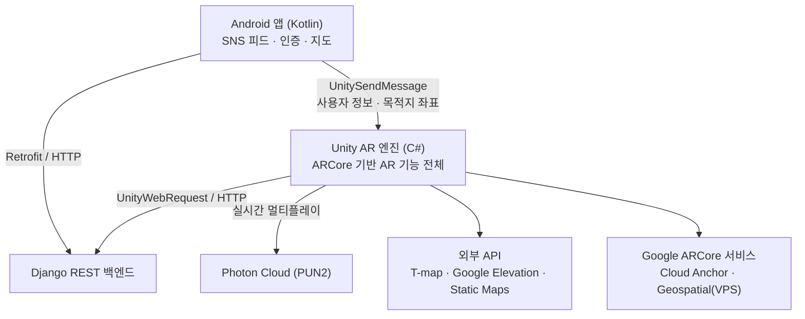

# IMAEZIM

> **이어짐 · 맺어짐 · 그려짐**<br>현실 공간에 AR 메모를 남기고, 직접 찾아가 감상하는 위치 기반 AR SNS

<p align="center">
  
</p>

<p align="center">
  
  
  
  
  
</p>

<p align="center">
  <b><a href="https://youtu.be/tUaR9V3uTP4">📺 데모 영상 보기 (YouTube)</a></b>
</p>

## 📍 목차

- [개요](#overview)
- [데모](#demo)
- [시스템 아키텍처](#architecture)
- [프로젝트 구조](#structure)
- [주요 기능 & 구현 기술](#features)
- [기술 스택](#stack)
- [API](#api)
- [빌드 & 실행](#build)
- [팀원 및 역할](#team)

---

<div id="overview"></div>

## 🚀 개요

| | |
|---|---|
| **개발 기간** | 2023.12 ~ 2024.09 |
| **팀 구성** | 5인 (Android 3 · Server 2) |
| **플랫폼** | Android (ARCore 지원 단말) |

SNS 사용 시간이 늘수록 대면 소통은 줄어든다는 문제에 주목해, **AR로 현실 공간의 상호작용을 유도하는 참여형 SNS**를 설계했습니다.
사용자는 실제 장소에 글·사진·영상 형태의 AR 메모를 남기고, 다른 사용자는 **그 자리에 직접 찾아가야** 메모를 볼 수 있습니다.

기술적으로는 **Android(Kotlin) SNS 셸 + Unity(ARCore) AR 엔진 + Django REST 백엔드** 3계층 구조이며,
AR 기능은 ARCore의 **Cloud Anchor**(실내)와 **Geospatial Anchor**(실외) 두 가지 앵커 방식을 목적에 따라 나눠 사용합니다.

---

<div id="demo"></div>

## 🎬 데모

<p align="center">
  <a href="https://youtu.be/tUaR9V3uTP4">
    
  </a>
</p>


<p align="center">
  
</p>

> **🚧 현재 상태**
> 배포된 APK와 스토어 링크가 없고, 백엔드 GCP 인스턴스도 현재 미운영입니다.
> **실제 동작은 위 데모 영상으로 확인**해 주세요. 소스 빌드 절차는 [빌드 & 실행](#build)에 정리했습니다.

---

<div id="architecture"></div>

## 🏗 시스템 아키텍처



### Android → Unity 연동 프로토콜

Unity를 Android 라이브러리로 export해 통합하는 구조이며, 연동은 **`UnitySendMessage` 단방향 호출**로 설계했습니다.
수신부는 `unity/Assets/Scripts/MainMenu.cs`에 정의돼 있습니다.

| 호출 순서 | 메서드 | 파라미터 | 동작 |
|:---:|---|---|---|
| 1 | `AndUserId` | 사용자 ID | `MainMenu.UserId` 설정 |
| 2 | `AndUserInfo` | 이메일 | `MainMenu.UserEmail` 설정 |
| 3 | `AndUserNick` | 닉네임 | `MainMenu.UserNickname` 설정 (메모 작성자·게임 닉네임에 사용) |
| 4 | `AndLatitude` | 위도 | `NavigationMode = memoNav`, 위도를 `PlayerPrefs`에 저장 |
| 5 | `AndLongitude` | 경도 | 경도 저장 후 `Geospatial` 씬 로드. **AR 길찾기 진입 트리거** |

- 4 → 5 **호출 순서가 보장돼야** 합니다. 마지막 `AndLongitude`가 씬 전환까지 함께 수행합니다.
- 씬 간 상태는 `PlayerPrefs` 키(`NavigationMode`, `memoLatitudeKey`, `memoLongitudeKey`, `MemoType`)로 공유합니다.

---

<div id="structure"></div>

## 📁 프로젝트 구조

`app/`과 `unity/`는 **각각 독립적으로 열고 빌드하는 별도 프로젝트**입니다. (`settings.gradle.kts`는 `:app`만 포함)

```
imaezim/
├── app/                          # Android 앱 (Kotlin · Gradle)
│   └── src/main/java/com/example/imaezim/
│       ├── MainActivity.kt           # 로그인
│       ├── JoinActivity.kt           # 회원가입
│       ├── HomeActivity.kt           # 전체 피드
│       ├── MyFeedActivity.kt         # 내 피드 (메모 타입별 뷰 전환)
│       ├── ARActivity.kt             # AR 진입점 (Unity 연동 지점)
│       ├── HomeAdapter.kt            # 피드 행 + 행별 Google MapView
│       ├── MyFeedAdapter.kt          # 내 피드 행 (텍스트/이미지/영상/음성)
│       └── retrofit/                 # Retrofit 클라이언트 · 인터페이스 · DTO
│
└── unity/Assets/                 # Unity AR 프로젝트 (C#)
    ├── CloudAnchorManager.cs         # AR 실내 메모 (Cloud Anchor 호스팅/복원)
    ├── ObjectMemo.cs                 # 물건 메모 (카메라 캡처 → 서버 객체 매칭)
    ├── MapManager.cs                 # GPS + Google Static Maps 미니맵
    ├── ARQuizScript/                 # AR 퀴즈 (배치 · CRUD · 정답 판정)
    ├── Scripts/
    │   ├── MainMenu.cs               # 씬 라우팅 + Android 수신부
    │   ├── LobbyManager.cs           # Photon 로비 · 랭킹
    │   ├── SpawnManager*.cs          # 게임 오브젝트 스폰 (평면 / Geospatial)
    │   ├── ARMemoSet{Text,Picture,Video}.cs   # 메모 프리팹 렌더링
    │   ├── Mercator.cs               # 좌표계 변환 · 거리/방위 계산
    │   └── PlayerScript/             # 이동 · 동기화 · 체력 · 리스폰
    └── Samples/ARCore Extensions/.../Geospatial Sample/Scripts/
        ├── GeospatialController.cs   # AR 실외 메모 + AR 길찾기 (핵심 로직)
        ├── GetServer.cs              # 실외 메모 조회 → 앵커 복원
        └── api.cs                    # T-map 보행자 경로 + 고도 API 클라이언트
```

**빌드 씬 10개**: `MainTitleScene` · `IndoorScene` · `Geospatial` · `ObjMemoScene` · `Quiz3DScene` · `Scene_Lobby` · `Scene_PlayerSelection` · `Scene_SearchRoom` · `Scene_Loading` · `BattleArena_H`

---

<div id="features"></div>

## 🔌 주요 기능 & 구현 기술

### AR 실내 메모 (Cloud Anchor)

GPS가 닿지 않는 실내에서 메모 위치를 고정하기 위해 **ARCore Cloud Anchor**를 사용합니다.

- 평면 감지 후 `ARRaycastManager`로 탭 지점에 로컬 앵커 생성
- `EstimateFeatureMapQualityForHosting()`으로 특징점 품질을 실시간 평가하고, `MapQualityIndicator`로 사용자에게 "더 둘러보세요" 피드백 제공
- 품질 충족 시 `HostCloudAnchor(anchor, TTL 1일)` → 발급된 `cloudAnchorId`를 메모 데이터와 함께 서버에 저장
- 다른 사용자는 서버에서 받은 ID로 `ResolveCloudAnchorId()` 하여 **같은 위치·같은 방향**에 메모를 복원

> `unity/Assets/CloudAnchorManager.cs` : `READY → HOST → HOST_PENDING → RESOLVE → RESOLVE_PENDING` 상태 머신

### AR 실외 메모 (Geospatial Anchor)

실외에서는 GPS 오차를 보정하기 위해 **ARCore Geospatial API(VPS)** 를 사용합니다.

- `AREarthManager`의 `EarthTrackingState`로 측위 정확도를 확인한 뒤에만 앵커 생성 허용
- 위경도 + 고도 + EUN 쿼터니언으로 앵커를 저장/복원 → 세션이 달라도 동일 지점에 재현
- 지면 높이를 모를 때는 **Terrain Anchor**, 건물 옥상 배치는 **Rooftop Anchor** 비동기 API 사용
- **Streetscape Geometry**로 건물·지형 메시를 받아 메모가 건물을 뚫고 보이지 않도록 오클루전 처리
- 메모 타입별 분기 저장 (`A` 텍스트 / `B` 사진 / `D` 영상)

> `unity/Assets/Samples/.../GeospatialController.cs`, `GetServer.cs`

### 물건 메모 (서버 사이드 객체 인식)

특정 **물건**에 메모를 붙이는 기능입니다. 온디바이스 ML 모델 없이 서버 인식에 위임했습니다.

- `WebCamTexture`로 후면 카메라 프레임을 직접 캡처
- 등록 시 **10프레임을 연속 캡처**해 업로드 → 서버가 특징점 부족(`Few feature points`) 여부를 판정하고 중복 객체면 기존 ID 재사용 여부를 되물음
- 조회 시 1프레임을 업로드해 매칭된 물건의 메모를 가져옴

> `unity/Assets/ObjectMemo.cs`

### AR 길찾기

SNS 피드에서 고른 메모까지 **AR 화살표로 안내**합니다.

- **SK T-map 보행자 경로 API**로 도보 경로를 요청해 Point/LineString 좌표열을 파싱
- 각 경로 지점의 고도를 **Google Elevation API**로 보정
- 좌표열을 따라 Geospatial 앵커 화살표를 실제 도로 위에 배치하고 남은 거리를 표시
- `NavigationMode`로 메모 안내(`memoNav`)와 게임 장소 안내(`gameNav`) 분기

> `unity/Assets/Samples/.../api.cs`, `GeospatialController.PlaceGeospatialAnchor_nav()`, `unity/Assets/Scripts/Mercator.cs`

### AR 게임 (Photon 실시간 멀티플레이)

- **Photon PUN2**로 룸 매칭(랜덤 매칭 실패 시 방 생성 폴백), 방 이름 검색 입장, 캐릭터 선택
- `IPunObservable.OnPhotonSerializeView` + `PhotonNetwork.Time` 기반 **랙 보정 트랜스폼 동기화**
- 피격·사망·리스폰은 `[PunRPC]`, 아레나 배치 정보는 `RaiseEvent` 커스텀 이벤트로 브로드캐스트
- 배치 방식 2종: **평면 감지 기반**(기본) / **Geospatial 좌표 공유**(마스터가 아레나 GPS를 전파해 양쪽 단말이 동일 위치에 재구성)

> `unity/Assets/Scripts/` : `LobbyManager`, `SpawnManager`, `SpawnManager_ForGeo`, `Damage`, `Synchronization`

### AR 퀴즈

- 런타임에 `AREarthManager`를 생성해 Geospatial 앵커로 퀴즈 오브젝트를 실제 위치에 고정
- 신규 퀴즈는 평면 감지로 배치 후 등록, 4지선다 작성 UI 제공
- 서버와 퀴즈 CRUD 및 사용자별 정답 이력 동기화 → 이미 푼 퀴즈는 상태 구분 표시

> `unity/Assets/ARQuizScript/`

---

<div id="stack"></div>

## 🧰 기술 스택

### Android (`app/`)

| Category | Tech | Version |
|---|---|---|
| Language | Kotlin | 1.9.0 |
| Build | Gradle / AGP | 8.0 / 8.1.2 |
| SDK | compileSdk / minSdk / targetSdk | 34 / 26 / 33 |
| UI | ViewBinding, DataBinding, Material Components | 1.10.0 |
| Network | Retrofit + Gson Converter + OkHttp Logging | 2.9.0 / 4.12.0 |
| Map | Google Maps SDK (`play-services-maps`) | 18.2.0 |
| Image | Picasso | 2.8 |

### Unity AR (`unity/`)

| Category | Tech | Version |
|---|---|---|
| Engine | Unity | 2023.3.0a11 |
| Language | C# (.NET Standard 2.1) | - |
| AR | AR Foundation (`com.unity.feature.ar`) | 1.0.2 |
| AR | ARCore XR Plugin | 6.0.0-pre.3 |
| AR | ARCore Extensions (Cloud Anchor · Geospatial) | 1.43.0 |
| XR | XR Management | 4.4.0 |
| Network | Photon PUN2 / Photon Realtime | 2.45 / 4.1.8 |
| Native | NativeGallery (갤러리 연동) | 1.7.7 |
| Audio | NAudio (음성 메모 디코딩) | - |
| Build | IL2CPP · minSdk 24 · ARMv7/ARM64 | - |

### Backend & 외부 서비스

| Category | Tech |
|---|---|
| Server | Python · Django 4.2.2 · Django REST Framework 3.14.0 |
| Database | SQLite |
| Media | Pillow (이미지 처리) |
| Vision | YOLO (물건 인식, 서버 사이드) |
| Realtime | Photon Cloud |
| External API | SK T-map 보행자 경로, Google Elevation, Google Static Maps |
| Modeling | Blender |
| Collaboration | Notion, Figma, GitHub |

---

<div id="api"></div>

## 🌐 API

Django REST 백엔드와 통신합니다. 아래 `<SERVER_HOST>`는 각 모듈에 설정된 서버 주소입니다.

### Android 앱 → 서버

| Method | Endpoint | 설명 |
|---|---|---|
| `GET` | `/common/user_drf/` | 사용자 조회 |
| `POST` | `/common/user_drf/` | 회원가입 |
| `POST` | `/common/user/` | 이메일로 사용자 조회 |
| `GET` | `/sns/feed/` | 전체 피드 |
| `GET` | `/sns/mypage/?userId=` | 내 피드 |

### Unity AR → 서버

| Method | Endpoint | 기능 |
|---|---|---|
| `POST` / `GET` | `/inside/addMemo/` · `/inside/memoInfo/` | 실내 메모 (Cloud Anchor ID) |
| `POST` / `GET` | `/outside/addMemo/` · `/outside/memoInfo/` | 실외 메모 (Geospatial) |
| `GET` | `/outside/get_last_{Postid,Image,Video}/{userId}/` | 최근 업로드 조회 |
| `POST` | `/object/addObj/` · `/object/searchObj/` · `/object/addText/` | 물건 등록 / 검색 / 메모 |
| `GET` `POST` `DELETE` | `/quiz/quiz_api/` (`/{quizId}/`) | 퀴즈 CRUD |
| `GET` / `POST` | `/quiz/correct_quiz_api/` (`/{userId}/`) | 정답 이력 |
| `GET` | `/stadium/ranking/` | 게임 랭킹 |

### 외부 API

| 서비스 | 용도 |
|---|---|
| SK T-map 보행자 경로 | AR 길찾기 경로 폴리라인 |
| Google Elevation | 경로 지점 고도 보정 |
| Google Static Maps | 실내 메모 화면 미니맵 |
| Google Maps SDK | 피드 항목별 위치 썸네일 |

---

<div id="build"></div>

## ⚙️ 빌드 & 실행

> **배포된 APK와 스토어 링크가 없고, 백엔드 GCP 인스턴스도 현재 미운영입니다.**
> 실제 동작은 [데모 영상](https://youtu.be/tUaR9V3uTP4)으로 확인해 주세요.
> 아래는 소스에서 직접 빌드할 때의 절차입니다.

### Android (`app/`)

| 요구사항 | 버전 |
|---|---|
| JDK | 17 |
| Gradle / AGP / Kotlin | 8.0 / 8.1.2 / 1.9.0 |
| SDK | compileSdk 34 · minSdk 26 · targetSdk 33 |

```bash
# Google Maps API 키 주입 (키는 저장소에 커밋하지 마세요)
echo "MAPS_API_KEY=<your-key>" >> local.properties

./gradlew assembleDebug
# → app/build/outputs/apk/debug/app-debug.apk
```

`signingConfigs`가 없어 debug 키로 서명되므로 별도 keystore 없이 APK가 생성됩니다.
다만 **백엔드가 미운영이라 설치해도 로그인·피드는 빈 화면**으로 동작합니다.

### Unity (`unity/`)

Unity **2023.3.0a11**로 프로젝트를 열면 AR 씬 10개를 에디터에서 확인할 수 있습니다.
Cloud Anchor / Geospatial 은 **Keyless(Google Sign-in) 인증** 방식으로 설정돼 있습니다.

> **⚠️ 현재 상태 그대로는 Android 플레이어 빌드가 통과하지 않습니다.**
>
> 1. `Assets/Scripts/SpawnManager.cs`, `Assets/Scripts/SpawnManager_ForMeter.cs`가 `UnityEditor` 네임스페이스를 `#if UNITY_EDITOR` 가드 없이 참조합니다. `UnityEditor`는 플레이어 빌드에 포함되지 않아 컴파일 오류가 발생합니다.
> 2. `Packages/manifest.json`의 ARCore Extensions 의존성이 **태그·리비전이 없는 git URL**이라 빌드 재현성이 보장되지 않습니다.
> 3. 에디터 버전이 alpha(`2023.3.0a11`)라 동일 환경 재구성 난이도가 높습니다.

### 통합 빌드

Unity 프로젝트를 **Android 라이브러리로 export**한 뒤 `unityLibrary` 모듈로 추가하고, `ARActivity`에서 `UnitySendMessage`로 [연동 프로토콜](#architecture)의 5개 메서드를 순서대로 호출하는 구조입니다.
현재 저장소에는 export 산출물과 통합 모듈이 포함돼 있지 않습니다.

### API 키 설정

| 키 | 주입 위치 |
|---|---|
| Google Maps API Key | `local.properties` → `MAPS_API_KEY` |
| SK T-map appKey | `unity/Assets/Samples/.../Geospatial Sample/Scripts/api.cs` |
| Google Elevation / Static Maps Key | Unity Inspector (`MapManager`) |
| Photon App ID | `PhotonServerSettings` 에셋 |

---

<div id="team"></div>

## 👥 팀원 및 역할

| 이름 | GitHub | 파트 | 담당 |
|---|---|---|---|
| **경다은** (팀장) | [@literallyme1](https://github.com/literallyme1) | Server | AR 실외 메모 · AR 게임 · AR 퀴즈 · 서버 |
| **김가윤** | [@JCTA0125](https://github.com/JCTA0125) | Android | AR 실내 메모 · AR 게임 · Android 앱 |
| **서윤수** | [@imyoonsoo](https://github.com/imyoonsoo) | Android | AR 실내 메모 · AR 게임 3D 모델링 · Android 앱 |
| **오다은** | [@daeun408](https://github.com/daeun408) | Server | AR 실외 메모 · 물건 메모 · AR 길찾기 · 서버 |
| **전은채** | [@AJ04K](https://github.com/AJ04K) | Android | AR 실내 메모 · 물건 메모 · AR 길찾기 · Android 앱 |
