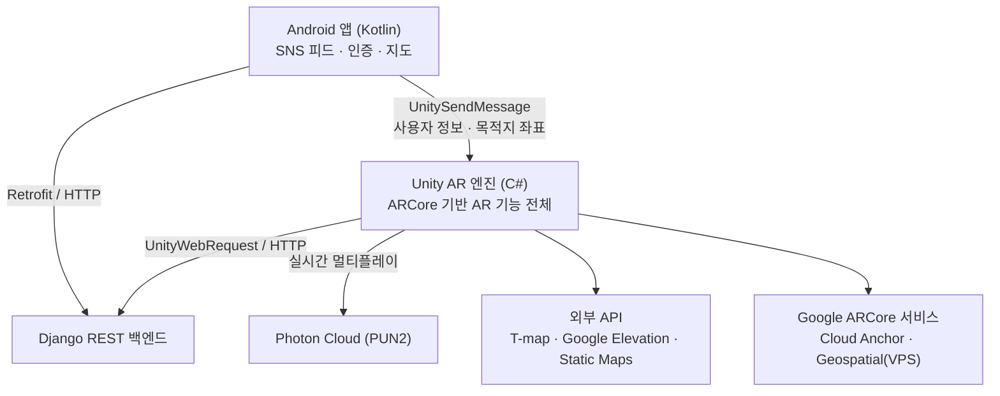

<h1>
  
  IMAEZIM
</h1>

> 이어짐 맺어짐 그려짐, 이매짐

<p align="center">
  <a href="https://youtu.be/tUaR9V3uTP4">
    
  </a>
</p>

> **Demo** · 위 이미지를 클릭하면 YouTube 전체 시연 영상으로 이동합니다.

## 📍 목차

- [개요](#overview)
- [주요 기능](#features)
- [기술 스택](#stack)
- [시스템 아키텍처](#architecture)
- [프로젝트 구조](#structure)
- [팀원 및 역할](#team)

---

<div id="overview"></div>

## 🖥️ 개요

| | |
|---|---|
| **개발기간** | 2023.12 ~ 2024.09 |
| **팀 구성** | 5인 (Frontend 3 · Backend 2) |
| **성과** | 캡스톤디자인 경연대회 우수상 · 한국정보통신학회논문지(KCI) 게재 |

SNS 사용 시간이 늘수록 대면 소통은 줄어든다는 문제에 주목해, AR로 현실 공간의 상호작용을 유도하는 참여형 SNS를 설계했습니다.
사용자는 실제 장소에 글·사진·영상 형태의 AR 메모를 남기고, 다른 사용자는 그 자리에 직접 찾아가야 메모를 볼 수 있습니다.

> APK 설치형으로 진행한 프로젝트라 배포 링크가 없고, 백엔드 서버도 현재 미운영입니다. 실행 결과는 위 시연 영상으로 확인해 주세요.

---

<div id="features"></div>

## ✨ 주요 기능

### AR 실내 메모

GPS가 닿지 않는 실내에서도 메모 위치를 고정하기 위해 **ARCore Cloud Anchor**를 사용합니다.
주변 특징점 품질을 실시간으로 평가해 충분할 때만 앵커를 등록하고, 다른 사용자는 같은 위치·같은 방향에서 메모를 복원합니다.

### AR 실외 메모

**ARCore Geospatial API(VPS)** 로 GPS 오차를 보정해 실제 좌표에 메모를 고정합니다.
지면 높이는 Terrain Anchor, 건물 옥상은 Rooftop Anchor로 처리하고, Streetscape Geometry로 건물 뒤 메모가 비쳐 보이지 않게 가립니다.

### 물건 메모

후면 카메라로 물건을 여러 각도에서 촬영해 등록하고, 나중에 같은 물건을 비추면 붙여둔 메모를 불러옵니다.
객체 인식은 서버 사이드 **YOLO**가 담당합니다.

### AR 길찾기

**T-map 보행자 경로 API**로 도보 경로를 받아 각 지점의 고도를 보정한 뒤, 실제 길 위에 AR 화살표를 배치해 목적지 메모까지 안내합니다.

### AR 게임

**Photon PUN2** 기반 2인 실시간 대전입니다.
평면 감지로 현실 바닥에 경기장을 배치하고, 이동·공격·피격 상태를 룸 단위로 동기화합니다.

### AR 퀴즈

특정 좌표에 3D 퀴즈 오브젝트를 고정해 두고, 직접 이동하며 문제를 풉니다.
사용자별 정답 이력이 서버에 기록되어 이미 푼 퀴즈는 따로 표시됩니다.

<p align="center">
  
  &nbsp;
  
</p>

---

<div id="stack"></div>

## 🔧 기술 스택

| Category | Tech |
|---|---|
| **Client** | Kotlin, Android, Unity |
| **AR** | ARCore, Cloud Anchor, Geospatial API |
| **Multiplayer** | Photon PUN2 |
| **Server** | Python, Django, Django REST Framework |
| **Database** | SQLite |
| **Computer Vision** | YOLO |
| **Map / Location** | SK T-map, Google Elevation, Google Static Maps |
| **3D** | Blender |

---

<div id="architecture"></div>

## 🏗️ 시스템 아키텍처



### Android → Unity 연동 프로토콜

Unity를 Android 라이브러리로 export해 통합하는 구조이며, 연동은 **`UnitySendMessage` 단방향 호출**로 설계했습니다.

| 호출 순서 | 메서드 | 파라미터 | 동작 |
|:---:|---|---|---|
| 1 | `AndUserId` | 사용자 ID | 사용자 식별자 전달 |
| 2 | `AndUserInfo` | 이메일 | 계정 정보 전달 |
| 3 | `AndUserNick` | 닉네임 | 메모 작성자·게임 닉네임에 사용 |
| 4 | `AndLatitude` | 위도 | 목적지 위도 저장 |
| 5 | `AndLongitude` | 경도 | 목적지 경도 저장 후 AR 길찾기 씬 진입 |

---

<div id="structure"></div>

## 🗂️ 프로젝트 구조

`app/`과 `unity/`는 **각각 독립적으로 열고 빌드하는 별도 프로젝트**입니다.

```
imaezim/
├── app/                       # Android 앱 (Kotlin · Gradle)
│   └── src/main/java/com/example/imaezim/
│       ├── MainActivity.kt        # 로그인
│       ├── JoinActivity.kt        # 회원가입
│       ├── HomeActivity.kt        # 전체 피드
│       ├── MyFeedActivity.kt      # 내 피드
│       ├── ARActivity.kt          # AR 진입점 (Unity 연동 지점)
│       └── retrofit/              # 서버 통신 (클라이언트 · 인터페이스 · DTO)
│
└── unity/Assets/              # Unity AR 프로젝트 (C#)
    ├── CloudAnchorManager.cs      # AR 실내 메모
    ├── ObjectMemo.cs              # 물건 메모
    ├── MapManager.cs              # GPS · 미니맵
    ├── ARQuizScript/              # AR 퀴즈
    ├── Scripts/                   # 씬 라우팅 · Photon 멀티플레이 · 메모 렌더링
    └── Samples/.../Geospatial Sample/Scripts/
                                   # AR 실외 메모 · AR 길찾기
```

---

<div id="team"></div>

## 👥 팀원 및 역할

<table>
  <tr>
    <td align="center" width="150px">
      <a href="https://github.com/literallyme1">
        
      </a>
      <br/><b>경다은 (팀장)</b><br/>
      
      <br/>
      <sub>AR 실외 메모<br/>AR 게임<br/>AR 퀴즈<br/>Server</sub>
    </td>
    <td align="center" width="150px">
      <a href="https://github.com/JCTA0125">
        
      </a>
      <br/><b>김가윤</b><br/>
      
      <br/>
      <sub>AR 실내 메모<br/>AR 게임<br/>Android 앱</sub>
    </td>
    <td align="center" width="150px">
      <a href="https://github.com/imyoonsoo">
        
      </a>
      <br/><b>서윤수</b><br/>
      
      <br/>
      <sub>AR 실내 메모<br/>AR 게임 3D 모델링<br/>Android 앱</sub>
    </td>
    <td align="center" width="150px">
      <a href="https://github.com/daeun408">
        
      </a>
      <br/><b>오다은</b><br/>
      
      <br/>
      <sub>AR 실외 메모<br/>물건 메모<br/>AR 길찾기<br/>Server</sub>
    </td>
    <td align="center" width="150px">
      <a href="https://github.com/AJ04K">
        
      </a>
      <br/><b>전은채</b><br/>
      
      <br/>
      <sub>AR 실내 메모<br/>물건 메모<br/>AR 길찾기<br/>Android 앱</sub>
    </td>
  </tr>
</table>
